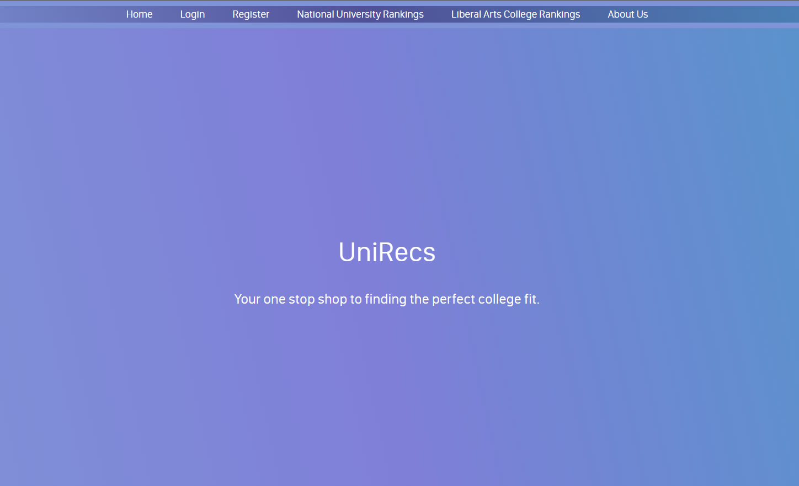

# UniRecs

Welcome to UniRecs, a website that recommends colleges and universities in the United States to prospective college students. To start using the app locally, run `npm start` to start the React application and  to start the Python Flask server. A browser tab will open up the landing page of the website. We also have a Docker image on Docker Hub as well as a preliminary website domain:

Docker Hub: [https://hub.docker.com/r/npadmana015/unirecs-test ](https://hub.docker.com/r/npadmana015/unirecs-test )

DigitalOcean Website: [https://unirecs-test-h25g7.ondigitalocean.app/](https://unirecs-test-h25g7.ondigitalocean.app/)

You can hit the **Login** tab to login if you have an account already, or click on the **No Account? Register here!** link. You can also register for a new account by clicking **Register** tab.

After logging into your account, you are presented with four buttons:

* Logout: Logs user out of current session
* Take Quiz: Directs user to a series of quizzes that determines the right fit of colleges/universities
* Previous Responses: Directs user to a list view of user's quiz responses
* Recommendations: Presents a sample recommendation of colleges based on cosine similarity

Here's a sample view of recommendations:

As for the progress of this project, we still need to refine our recommendations to be expanded to more colleges and universities. In addition, we are working on improving the connection between the user responses and the strength of the recommendations. We are open to having improved datasets to make better recommendations as well as having updates for new USNews rankings. Please make a pull request to alert us for any changes you want to see.

# This project was bootstrapped with [Create React App](https://github.com/facebook/create-react-app).

## Available Scripts

In the project directory, you can run:

### `npm start`

Runs the app in the development mode.
Open [http://localhost:3000](http://localhost:3000) to view it in your browser.

The page will reload when you make changes.
You may also see any lint errors in the console.

### `npm test`

Launches the test runner in the interactive watch mode.
See the section about [running tests](https://facebook.github.io/create-react-app/docs/running-tests) for more information.

### `npm run build`

Builds the app for production to the `build` folder.
It correctly bundles React in production mode and optimizes the build for the best performance.

The build is minified and the filenames include the hashes.
Your app is ready to be deployed!

See the section about [deployment](https://facebook.github.io/create-react-app/docs/deployment) for more information.

### `npm run eject`

**Note: this is a one-way operation. Once you `eject`, you can't go back!**

If you aren't satisfied with the build tool and configuration choices, you can `eject` at any time. This command will remove the single build dependency from your project.

Instead, it will copy all the configuration files and the transitive dependencies (webpack, Babel, ESLint, etc) right into your project so you have full control over them. All of the commands except `eject` will still work, but they will point to the copied scripts so you can tweak them. At this point you're on your own.

You don't have to ever use `eject`. The curated feature set is suitable for small and middle deployments, and you shouldn't feel obligated to use this feature. However we understand that this tool wouldn't be useful if you couldn't customize it when you are ready for it.

## Learn More

You can learn more in the [Create React App documentation](https://facebook.github.io/create-react-app/docs/getting-started).

To learn React, check out the [React documentation](https://reactjs.org/).

### Code Splitting

This section has moved here: [https://facebook.github.io/create-react-app/docs/code-splitting](https://facebook.github.io/create-react-app/docs/code-splitting)

### Analyzing the Bundle Size

This section has moved here: [https://facebook.github.io/create-react-app/docs/analyzing-the-bundle-size](https://facebook.github.io/create-react-app/docs/analyzing-the-bundle-size)

### Making a Progressive Web App

This section has moved here: [https://facebook.github.io/create-react-app/docs/making-a-progressive-web-app](https://facebook.github.io/create-react-app/docs/making-a-progressive-web-app)

### Advanced Configuration

This section has moved here: [https://facebook.github.io/create-react-app/docs/advanced-configuration](https://facebook.github.io/create-react-app/docs/advanced-configuration)

### Deployment

This section has moved here: [https://facebook.github.io/create-react-app/docs/deployment](https://facebook.github.io/create-react-app/docs/deployment)

### `npm run build` fails to minify

This section has moved here: [https://facebook.github.io/create-react-app/docs/troubleshooting#npm-run-build-fails-to-minify](https://facebook.github.io/create-react-app/docs/troubleshooting#npm-run-build-fails-to-minify)
